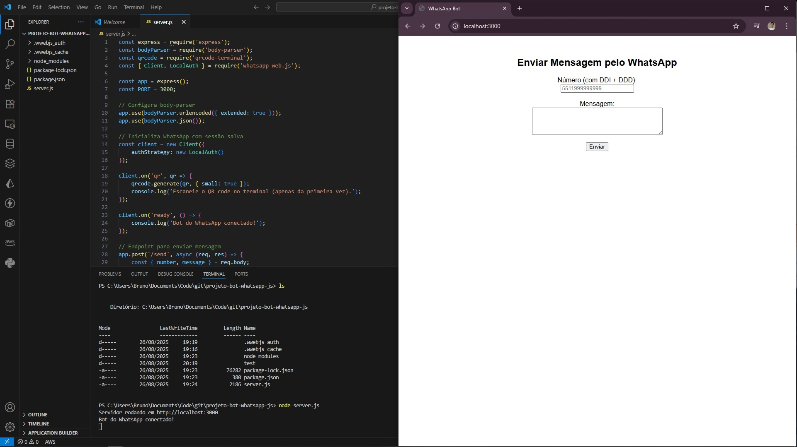

# 📱 WhatsApp Bot com Node.js + whatsapp-web.js

Este projeto é um **bot para WhatsApp** usando [whatsapp-web.js](https://github.com/pedroslopez/whatsapp-web.js), integrado a um **servidor Express** para envio de mensagens via requisição HTTP.

---

## 🚀 Funcionalidades
- Conexão com o WhatsApp Web via QR Code (armazenando sessão localmente).
- API REST simples (`/send`) para envio de mensagens.
- Interface web básica para enviar mensagens diretamente do navegador.

- 

---

## 📦 Pré-requisitos
Antes de começar, você precisa ter instalado:
- [Node.js](https://nodejs.org/) (versão 16 ou superior recomendada)
- [npm](https://www.npmjs.com/) (vem junto com o Node.js)

---

## ⚙️ Instalação

1. Clone este repositório:
   ```bash
   git clone https://github.com/BrunoFelicianoAlves/projeto-bot-whatsapp-js.git
   cd seu-repo

2. Instale as dependências:
   npm install

3. Inicie o servidor:
   node server.js

4. No primeiro uso, será exibido um QR Code no terminal.
📲 Escaneie com o WhatsApp do seu celular (Menu → Aparelhos Conectados → Conectar dispositivo).

5. Acesse no navegador para usar o formulário web de envio de mensagens.

⚠️ O número deve estar no formato internacional: DDI + DDD + número
Exemplo: Brasil/SP → 5511999999999

🛑 Observações importantes

Não compartilhe a pasta .wwebjs_auth/, pois ela contém dados da sua sessão.
O bot só funciona enquanto seu celular tiver internet e o WhatsApp estiver ativo.
Use apenas para fins legais e em conformidade com os Termos de Uso do WhatsApp.

